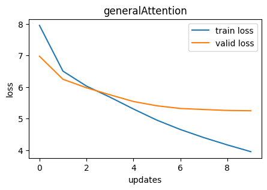
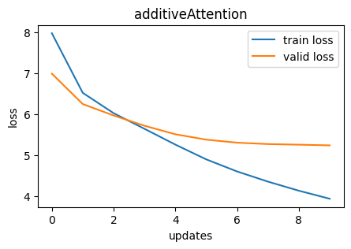
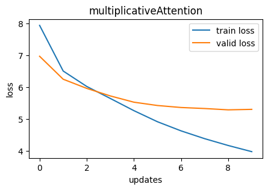
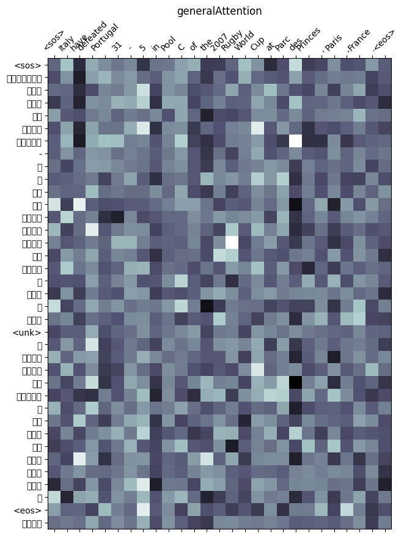
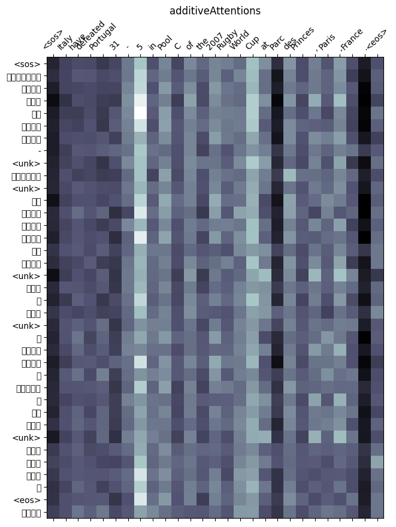
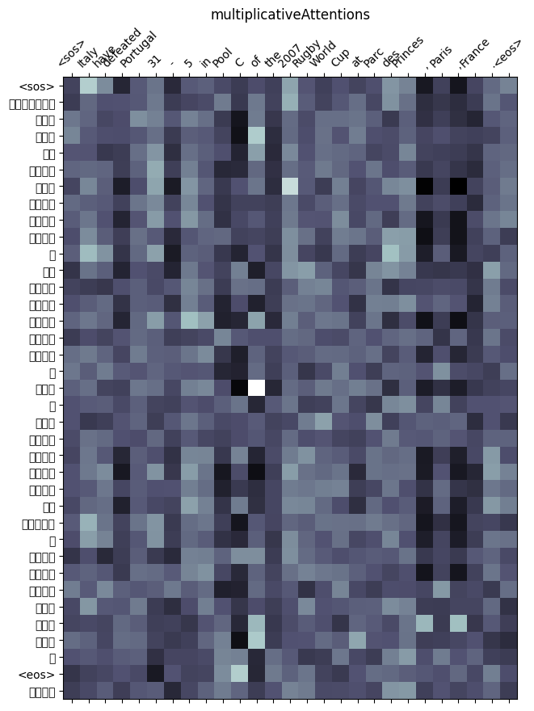

# A3: Language Translation : Translate English to Myanmar Language

This assignment is completed under the guidance of Professor Dr. Chaklam Silpasuwanchai in the AT82.05 Artificial Intelligence: Natural Language Understanding (NLU).

This is done by st124087 (Kyi Thin Nu)

## Section
- [Overview of this assignment](#overview-of-this-assignment)
    - [Brief Introduction](#brief-introduction)
    - [ Task1: Get Language Pair ](#task-1-get-language-pair)
        - [Dataset Information](#dataset-information)
        - [Data Preprocessing](#data-preprocessing)
    - [Task2: Experiment with Attention Mechanisms](#task-2-experiment-with-attention-mechanisms)
    - [Task 3: Evaluation and Verification](#task-3-evaluation-and-verification)
        - [Performance Comparison](#1-the-performance-comparison-between-the-attention-mechanisms)
        - [Performance Plot](#32-performance-plot)
        - [Attention Map](#33-attention-maps)
        - [Analysis](#34-analysis-the-results-of-translating-between-english-and-myanmar-language)
    - [Task 4: Web Application Development](#task-4-web-application-development)

## Overview of this assignment

### Brief Introduction
In this assignment, I will explore the domain of neural machine translation. The focus will be on
translating from English to Myanmar Language. I will experiment with different types of attention mechanisms, including general attention, multiplicative attention, and additive attention, to evaluate their effectiveness in the translation process.

### Task 1: Get Language Pair
#### Dataset Information
For this task, I will use the <b> Dataset Card for Asian Language Treebank (ALT) </b> from Hugging face.  [Dataset Link](https://huggingface.co/datasets/alt)

##### Dataset Licensing Information
Creative Commons Attribution 4.0 International (CC BY 4.0)

##### Citation Information
Please cite the following if you make use of the dataset:

Hammam Riza, Michael Purwoadi, Gunarso, Teduh Uliniansyah, Aw Ai Ti, Sharifah Mahani Aljunied, Luong Chi Mai, Vu Tat Thang, Nguyen Phuong Thai, Vichet Chea, Rapid Sun, Sethserey Sam, Sopheap Seng, Khin Mar Soe, Khin Thandar Nwet, Masao Utiyama, Chenchen Ding. (2016) "Introduction of the Asian Language Treebank" Oriental COCOSDA.

BibTeX:

@inproceedings{riza2016introduction,
  title={Introduction of the asian language treebank},
  author={Riza, Hammam and Purwoadi, Michael and Uliniansyah, Teduh and Ti, Aw Ai and Aljunied, Sharifah Mahani and Mai, Luong Chi and Thang, Vu Tat and Thai, Nguyen Phuong and Chea, Vichet and Sam, Sethserey and others},
  booktitle={2016 Conference of The Oriental Chapter of International Committee for Coordination and Standardization of Speech Databases and Assessment Techniques (O-COCOSDA)},
  pages={1--6},
  year={2016},
  organization={IEEE}
}

#### Data Preprocessing
(1) ALT dataset support a lot of languages. I create one dataset that contains a pair of English and Myanmar sentences.

(2) Then I do tokenization for both languages.
- Using spacy tokenizer, tokenized english sentences.
- For Myanmar languages, I segment the text using the method from Dr. Ye Kyaw Thu's word segmentation process.  [reference link](myWord: Syllable, Word and Phrase Segmenter for Burmese, Ye Kyaw Thu, Sept 2021, GitHub Link: https://github.com/ye-kyaw-thu/myWord)  
    - This tokenizer is to perform word segmentation based on the Viterbi algorithm leveraging bigram probabilities for effective word segmentation and the specified word delimiter (|).  
    - The Viterbi algorithm is applied to the input text, resulting in a list of segmented words.  
    - The segmented words are joined using the specified word delimiter.  
    - Leading and trailing whitespaces and the word delimiter are stripped for cleaner results.  
    - The final output is a list of cleaned words.  

(3) After that I process numericalization and building the vocab for my translation model.

(4) Then I prepare the data loader for handling the batching and preprocessing of text data for a sequence-to-sequence model.  
- Batch Size: The batch size for training the model is set to 64.  
- Sequential Transforms: This function is defined to apply a sequence of transformations to the input text. This is a higher-order function that takes multiple transforms as arguments and applies them sequentially to the input.  
- Tensor Transform: This function is defined to add the beginning-of-sequence (BOS) and end-of-sequence (EOS) tokens to the tokenized input text. It converts the token indices into a tensor.  
- Text Transform: A dictionary containing language-specific sequential transformations for text preprocessing. For each language (source and target), the transformations include tokenization, numericalization (conversion of tokens to indices), and tensor transformation (adding BOS/EOS and creating a tensor).  
- Collate Batch Function:  
    - this function is used by the DataLoader to collate data samples into batch tensors.  
    - The source sequences are padded to the maximum length in the batch using pad_sequence for proper batching and source batch tensor, source length tensor, and target batch tensor.  

### Task 2: Experiment with Attention Mechanisms
For modelling, I implement a sequence-to-sequence neural network for the translation task using the following mechanism.
- General Attention
- Multiplicative Attention
- Additive Attention

For the training, I used batch size = 64.
The dataset contains pair of English and Myanmar according to the followings size:
<ul>
    <li> training set  : 1000 lines </li>
    <li> validation set:  100 lines </li>
    <li> testing set   :  100 lines </li>
</ul>

Then I train the model using three different attentions.

The evaluation for each mechanism is as follows.
<table>
    <tr>
        <th>Attentions</th>
        <th>Training Loss</th>
        <th>Training PPL</th>
        <th>Validation Loss</th>
        <th>Validation PPL</th>
    </tr>
    <tr>
        <th>Attentions</th>
        <td>3.95</td>
        <td>52.07</td>
        <td>5.25</td>
        <td>190.25</td>
    </tr>
    <tr>
        <th>Additive Attentions</th>
        <td>3.94</td>
        <td>51.36</td>
        <td>5.24</td>
        <td>189.36</td>
    </tr>
    <tr>
        <th>Multiplicative Attentions</th>
        <td>4.17</td>
        <td>64.58</td>
        <td>5.29</td>
        <td>197.79</td>
    </tr>
</table>

### Task 3: Evaluation and Verification

#### 3.1 The Performance Comparison between the attention mechanisms.
- According to translation accuracy  
     I may say '0'. This could be because of my train/test/validation dataset limitation or the tokenization of Myanmar Language is not very strong enough.  

- According to computational efficiency  
<table>
    <tr>
        <th>  </th>
        <td> General Attention </td>
        <td> Additive Attention </td>
        <td> Multiplicative Attention </td>
    </tr>
    <tr>
        <th> Training Time </th>
        <td> 18m : 20s </td>
        <td> 88m : 25s </td>
        <td> 17m : 1s </td>
    </tr>
</table>

- Other relevant metrics  
    Underneat, I do some testing using BLEU for three attention mechanisms by generating one random sentence from my dataset. The result of bleu remains zero.  
    <i> Please check the details in my notebook. [Task3] </i>  

#### 3.2 Performance Plot  
This is the plot according to the losses and PPL for training and validation.  

#### 3.3 Attention Maps  

#### 3.4 Analysis the results of translating between English and Myanmar Language
- According to the translation accuracy, the additive attention gives me the most similar words.
- According to the computational efficiency, the multiplicative attention is the fastest while additive takes more than 3 times of the other models.

### Task 4: Web Application Development