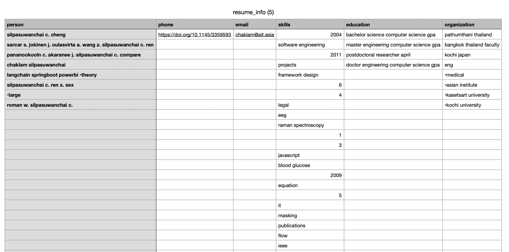

# A4: RESUME PARSER

This assignment is completed under the guidance of Professor Dr. Chaklam Silpasuwanchai in the AT82.05 Artificial Intelligence: Natural Language Understanding (NLU).

This is done by st124087 (Kyi Thin Nu)

## Section
- [Overview of this assignment](#overview-of-this-assignment)
- [ Task1: Implementation Foundation ](#task-1-implementation-foundation)
- [Task2: Resume Parsing Features - Web Application Development](#task-2-resume-parsing-features---web-application-development)

## Overview of this assignment

In this assignment, I will create a resume parser.  
Users will upload their resume in PDF format, and the system will output the contact information, a list of unique skills, education details and orgnization in order.

## Task 1: Implementation Foundation
I extend the resume parser code based on the spaCy class using the Resume Parsing.ipynb.  
Implement additional features or improvements inspired by spaCy’s capabilities in natural language
processing:
- Extract Person
- Extract Email
- Extract Phone Number
- Extract Education
- Extract Skills
- Extract Organization

## Task 2: Resume Parsing Features - Web Application Development
I develop a simple web application that showcases the capabilities of extraction. 
  

1. User can upload a PDF.  
  

2. Then system will extract the information including contact, skills, education and worked organization from the user uploaded file.  
  

3. The system will support to download the csv file version including the extracted information provided from the system.  
  